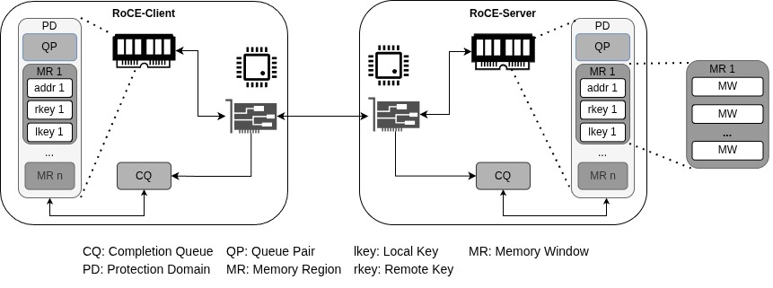
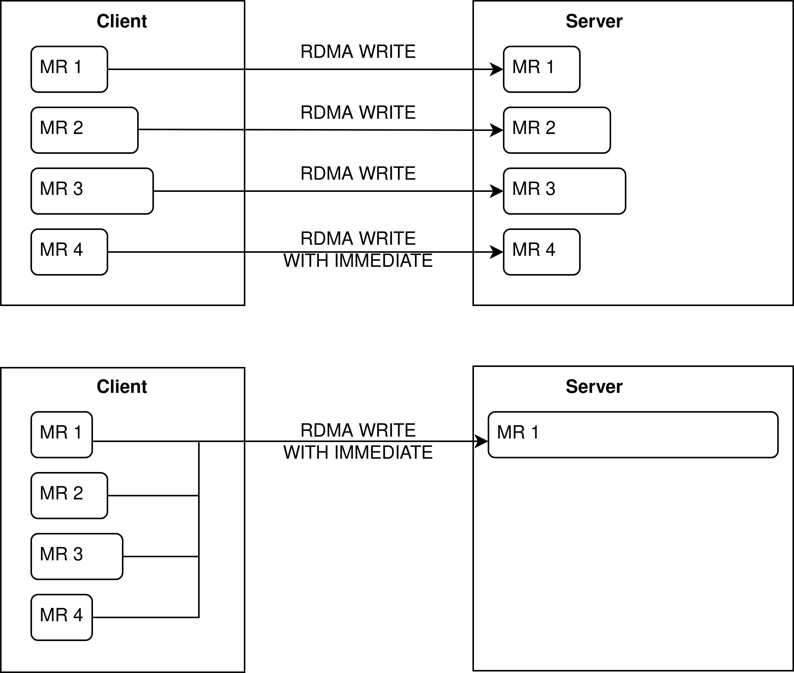

Introduction & Background
=========================

1. Introduction
---------------

The following sections concern the low-level API, which is used as a basis for remote direct
memory access (RDMA) based communication between an HPC node and a network
attached accelerator (NAA) on a field programmable gate array (FPGA). As part of the
NAAICE project, RDMA communication between the two is used to facilitate fast data
transfer for the offloading of specific calculations. The offloading of specific calculations
onto an NAA can lead to a reduction in overall runtime and energy consumption of a
given HPC job.

The API is written in C and makes use of two libraries for user-space based RDMA
communication. These libraries are ``libibverbs`` and ``librdmacm``, which are both part of the
``rdma-core`` library. ``libibverbs`` and ``librdmacm`` are implementations of the Infiniband
standard. Within the project, the used network protocol is RoCEv2 (RDMA over Converged Ethernet 2). RoCEv2 encapsulates Infiniband packets within UDP/IP packets,
thus making them routeable within an IP-based HPC center. ``libibverbs`` provides the
functionalities for setting up Infiniband communication structures, queue pairs (QP), as
well as other structures such as queues for sending and receiving operations as well as
a completion queue, where finished operations are noted. It encapsulates operations
for sending and receiving messages or data in a two-sided (``IBV_SEND``/``IBV_RECV``) or
one-sided ``IBV_WRITE``/``IBV_READ`` style. ``librdmacm`` provides a method for setting up an
Infiniband-based connection.

As a short introduction, the key structures and components of an Infiniband connection
will be discussed. The reader is referred to the Infiniband standard for more detailed
introduction [#infiniband_standard]_. Chapter 3 of the standard gives a broad introduction to the overall architecture. Generally, knowledge of socket-based communication is assumed, but can be
found in [#ipc]_. In Infiniband communication, queue pairs (QPs) are analogous to sockets.
Communication operations include two-sided ones like SEND and RECEIVE operations.
These explicitly synchronize the two communication partners and a SEND operations
cannot be done before the receiving side issues a RECEIVE. Additionally, one-sided communication is available as well, using WRITE or READ operations, as well as ATOMICS.
These one-sided operations are also known as remote direct memory access operations
(RDMA), since the CPU or user-space application on the receiving side is not involved
in the communication. A schematic of RDMA operations as they will be used within
the NAAICE project using RoCEv2 is shown in the following figure.

All communication requests are handled using work queues. These make up the afore-
mentioned queue pairs. The different queues are: send queues and receive queues as
well as completion queues. Send and receive queues are used to post work requests that
will be handled by the network interface card (NIC). Finished work requests (or failures)
are reported in the completion queue. Additionally, memory buffers that are used for
the transfer of data exist. These are called memory regions. Memory regions have to
be allocated and registered to the device. After registration, the NIC can access these
buffers without involvement of the CPU, a prerequisite for RDMA operations. Memory
regions are identified by an address and length. Accessing memory regions is restricted
through a set of a local and remote key (rkey, lkey). A memory region can be split
into different memory windows (MW) with their own keys. Many memory regions can
be associated with a single queue pair. As an overarching structure, protection domains
also exist. This structure combines memory regions and queue pairs and is used to provide 
a mechanism for access management. A memory region is registered to a pro-
tection domain and a queue pair allocated to a protection domain. Any given key set
of a memory region is only valid on queue pairs from the same protection domain ([#infiniband_standard]_,
p. 107). The figure above summarizes the relationship of the different components of an Infini-
band connection.

2. Host-NAA Communication Protocol
----------------------------------

Prior to implementing a low-level API, the communication pattern between an HPC
node and an NAA was discussed and explored. For this, a communication sequence
diagram was created by HHI, ZIB and UP. Within discussions for the communication
sequence diagram, a protocol for exchanging memory region metadata was designed
as well. The sequence diagram is shown in the following figure. The communication between
the HPC node and the NAA on the FPGA is analogous to the general client-server
model with remote procedure call (RPC) semantics. The HPC node acts as the client and initiates the connection. By transferring
data and a function code, it also initiates calculations on the FPGA in the style
of an asynchronous RPC. The FPGA takes on the role of the server, waits for connection
requests and responds to an RPC with the result data. The communication can be
split up in four different sections: The connection establishment, the setup of memory
regions, the data transfer (including RPC execution) and the connection termination.

..  figure:: ../_static/MRSP.jpg

**Connection Establishment**

The connection management is handled by functions from the library ``librdmacm``. Much
like in TCP, connection establishment is done by a three-way handshake. The client
sends a connection request (``REQ``), to which the server replies with a Reply message ``REP``.
Finally, the connection is fully established with a Ready-to-Use (``RTU``) message by the
client. Other message types for unsuccessful connections can be found in the Infiniband
Standard chapter 12.6 [#infiniband_standard]_. All message types for connection establishment defined in
the Infiniband standard are also implemented on the FPGA. In the low-level API the IP address of 
the server is a user argument for the client program. The server listens for connection
requests on a specific and known port. In future developments, the user can ask the
resource management system of the computer center for an FPGA with the desired
capabilities and will receive information on its IP address and the port number for
connection establishment.

**Memory Region Setup Protocol**

Before data can be transferred, meta information about the memory regions, i.e., buffers
registered to the NIC, has to be exchanged. Within the project, a protocol for memory
region setup has been developed. Generally, the client announces memory regions for
the transfer of results from the server to the client and requests memory regions on the
server for its input data. The advertisement for a memory region includes the address
of the region as well as the length and the remote key for access control. The request for
a memory region includes a valid physical FPGA address, the size and memory region
flags. These are unused so far, but can in the future be used to request regions on the
FPGA that will not be used for data transfer.

The MRSP is done using two messages. All memory regions are announced and requested by the client in one message. The server then handles this announcement and request and returns the virtual addresses and rkeys for the requested memory regions in a single message back to the client.

Earlier versions of the MRSP exist: First, a static approach was used. A single memory region is announced through a single message and the amount of requested memory on the server is requested through one single message as well. With this approach, the number of messages scales linearly with the amount of memory regions to exchange, requiring n advertisements and 1 request from the client and n advertisements from the server. As a second approach, a dynamic exchange of memory regions was developed. Herein, all announced memory regions are sent within a single message of variable size. Thus, both communication partners can announce the meta-information for all registered memory regions in one message per direction (excluding acknowledgements). Within the same message or another message type, the HPC node also requests an amount of memory to be registered in the server for data transfer. The different message types will be discussed in detail in the next section. The server then responds with the advertisement for the memory region(s) it has allocated in accordance with the overall size requested by the client. Therefore, the exchange of memory regions is done in 2 messages (excluding acknowledgements) regardless of the number of requested memory regions.

In another update, the user now announces host memory regions and FPGA memory regions of the same size in the same message. This is necessary, since the memory management of the FPGA will be outsourced to a service of the resource management system (RMS) or compute cluster. The user will receive valid FPGA memory addresses through this service and request these addresses on the FPGA.

The communication pattern for the exchange of memory region information is two-sided. Thus, ``IBV_SEND`` operations are used, for which a prior ``IBV_RECV`` work request has to be posted by the receiver. If the receiver has not posted such a request, the transfer will not work. Depending on the configuration, the sender will retry the transfer a number of times after a short pause. Note, that unsuccessful transfers are not easily spotted in network traffic recorded by tools like wireshark. In any case, the receiver will respond with an ack message. However, in unsuccessful transfers the ack-specific header includes a syndrome value of 32 instead of 0 for successful transfers.

**Message Types**

For the new memory setup protocol, specific message types were defined. This document limits itself to most recent implementation including the message type of the dynamic memory region setup protocol with FPGA addresses. The memory exchange protocol requires a total of 3 different messages so far.

- **0x00 Error:** A generic message including an error code to communicate errors during the MRSP.

- **0x01 Advertisement and Request:** Used by the client to announce its memory regions and request a specific amount of memory on the server

- **0x02 Advertisement:** Used by the server to announce its memory regions after a request. **Note:** This message type could also be used by the client, requiring a specific request message. This is already defined, but not used.

All messages share a similar structure as shown below
::

    0                   1                   2                   3
    0 1 2 3 4 5 6 7 8 9 0 1 2 3 4 5 6 7 8 9 0 1 2 3 4 5 6 7 8 9 0 1
  +-+-+-+-+-+-+-+-+- - - - - - - - - - - - - - - - - - - - - - - -
  |      Type     |             Type-Specific Data ...
  +-+-+-+-+-+-+-+-+- - - - - - - - - - - - - - - - - - - - - - - -

where type denotes the message types defined in the list above.
An Advertisement and Request message can include up to 256 memory regions, limited only be the ``count`` variable, which indicates the number of announced memory regions. This variable has 8 bits but can be expanded to use up to 24 bits (including 16 bits now used for padding). However, the current limit of 256 memory regions to be exchanged vastly outnumbers the amount of memory regions the FPGA can handle. In the current implementation, the FPGA is only able to handle up to 32 memory regions. Note: For regular compute nodes using ``ibverbs``, the amount of memory available for registration is hardware-specific as well.

.. code-block:: text
   :caption: Advertisement and Request Message

    0                   1                   2                   3
    0 1 2 3 4 5 6 7 8 9 0 1 2 3 4 5 6 7 8 9 0 1 2 3 4 5 6 7 8 9 0 1
   +-+-+-+-+-+-+-+-+-+-+-+-+-+-+-+-+-+-+-+-+-+-+-+-+-+-+-+-+-+-+-+-+
   |  Type = 0x01  |   Count = N   |            Padding            |
   +-+-+-+-+-+-+-+-+-+-+-+-+-+-+-+-+-+-+-+-+-+-+-+-+-+-+-+-+-+-+-+-+
   |   MR Flags    |           Requested                           |
   +-+-+-+-+-+-+-+-+                                               +
   |                         FPGA address  1                       |
   +-+-+-+-+-+-+-+-+-+-+-+-+-+-+-+-+-+-+-+-+-+-+-+-+-+-+-+-+-+-+-+-+
   |                                                               |
   +                        Published Addr 1                       +
   |                                                               |
   +-+-+-+-+-+-+-+-+-+-+-+-+-+-+-+-+-+-+-+-+-+-+-+-+-+-+-+-+-+-+-+-+
   |                        Published RKey 1                       |
   +-+-+-+-+-+-+-+-+-+-+-+-+-+-+-+-+-+-+-+-+-+-+-+-+-+-+-+-+-+-+-+-+
   |                        Published Size 1                       |
   +-+-+-+-+-+-+-+-+-+-+-+-+-+-+-+-+-+-+-+-+-+-+-+-+-+-+-+-+-+-+-+-+
   .                                                               .
   .                              ...                              .
   .                                                               .
   +-+-+-+-+-+-+-+-+-+-+-+-+-+-+-+-+-+-+-+-+-+-+-+-+-+-+-+-+-+-+-+-+
   |   MR Flags    |           Requested                           |
   +-+-+-+-+-+-+-+-+                                               +
   |                         FPGA address  N                       |
   +-+-+-+-+-+-+-+-+-+-+-+-+-+-+-+-+-+-+-+-+-+-+-+-+-+-+-+-+-+-+-+-+
   |                                                               |
   +                        Published Addr N                       +
   |                                                               |
   +-+-+-+-+-+-+-+-+-+-+-+-+-+-+-+-+-+-+-+-+-+-+-+-+-+-+-+-+-+-+-+-+
   |                        Published RKey N                       |
   +-+-+-+-+-+-+-+-+-+-+-+-+-+-+-+-+-+-+-+-+-+-+-+-+-+-+-+-+-+-+-+-+
   |                        Published Size N                       |
   +-+-+-+-+-+-+-+-+-+-+-+-+-+-+-+-+-+-+-+-+-+-+-+-+-+-+-+-+-+-+-+-+

The Advertisement and Request message includes the metadata for each memory region to be announced, i.e. the starting address, size and the remote key, which needs to be included in each RDMA request later on. 
The Advertisement message is a part of the Advertisement and Request message, excluding the request part and is, up to now, solely used by the RDMA server. Its structure is depicted below:

..  code-block:: text

     0                   1                   2                   3
     0 1 2 3 4 5 6 7 8 9 0 1 2 3 4 5 6 7 8 9 0 1 2 3 4 5 6 7 8 9 0 1
    +-+-+-+-+-+-+-+-+-+-+-+-+-+-+-+-+-+-+-+-+-+-+-+-+-+-+-+-+-+-+-+-+
    |  Type = 0x02  |   Count = N   |            Padding            |
    +-+-+-+-+-+-+-+-+-+-+-+-+-+-+-+-+-+-+-+-+-+-+-+-+-+-+-+-+-+-+-+-+
    |                                                               |
    +                        Published Addr 1                       +
    |                                                               |
    +-+-+-+-+-+-+-+-+-+-+-+-+-+-+-+-+-+-+-+-+-+-+-+-+-+-+-+-+-+-+-+-+
    |                        Published RKey 1                       |
    +-+-+-+-+-+-+-+-+-+-+-+-+-+-+-+-+-+-+-+-+-+-+-+-+-+-+-+-+-+-+-+-+
    |                        Published Size 1                       |
    +-+-+-+-+-+-+-+-+-+-+-+-+-+-+-+-+-+-+-+-+-+-+-+-+-+-+-+-+-+-+-+-+
    .                                                               .
    .                              ...                              .
    .                                                               .
    +-+-+-+-+-+-+-+-+-+-+-+-+-+-+-+-+-+-+-+-+-+-+-+-+-+-+-+-+-+-+-+-+
    |                                                               |
    +                        Published Addr N                       +
    |                                                               |
    +-+-+-+-+-+-+-+-+-+-+-+-+-+-+-+-+-+-+-+-+-+-+-+-+-+-+-+-+-+-+-+-+

Lastly, the error message only includes an error code:

..  code-block:: text

    0                   1                   2                   3
    0 1 2 3 4 5 6 7 8 9 0 1 2 3 4 5 6 7 8 9 0 1 2 3 4 5 6 7 8 9 0 1
    +-+-+-+-+-+-+-+-+-+-+-+-+-+-+-+-+-+-+-+-+-+-+-+-+-+-+-+-+-+-+-+-+
    |  Type = 0x00  |   Error Code  |            Padding            |
    +-+-+-+-+-+-+-+-+-+-+-+-+-+-+-+-+-+-+-+-+-+-+-+-+-+-+-+-+-+-+-+-+

The 8-bit variable allows 256 different error codes and can be extended if more codes are necessary.

The first set of error codes have already been defined. The error message is self will only be used for errors related to the exchange of memory region. For the connection management, messages signaling errors are already included and error handling is part of the ``librdmacm`` library. Error in data transfer are reported in the completion queue and do not need a specific error messages. Errors during the calculation are reported by the server as the immediate value within the ``IBV_WRITE_WITH_IMM`` message.

The error codes defined for the exchange of memory regions so far are:

- **0x01**: Not enough memory available (address + size exceeds the memory boundary)
- **0x02**: Invalid address (address is out of bounds)
- **0x03**: Too many regions requested

**Data Transfer (and calculations)**

Data transfer occurs twice. First the HPC node sends input data to the NAA. Data will be using one-sided RDMA operations. If the data transfer can be done in one operation, i.e. only one MR is transferred, an ``IBV_WRITE_WITH_IMM`` (Write with immediate data) will be used. The immediate data is a 32-bit value that is transferred with the data. This immediate data is used to transfer the function code, i.e. which calculation is to be done by the FPGA. If n > 1 operations are used, n-1 ``IBV_WRITE`` operations are done and a single last ``IBV_WRITE_WITH_IMM``. Unlike for simple ``IBV_WRITE`` operations, the receiver has to post a receive work request, as seen above in case of ``IBV_SEND`` operations. Using this, explicit synchronization after the last data transfer between sender and receiver is done.

Next, the NAA does calculations, while the HPC node waits for response. Whether explicit waiting or polling is used by the HPC node is outside the scope of this document and will be handled in AP 2. After calculations are done, the FPGA sends results data back in the same way it received data. Again, the last transfer operation will be an ``IBV_WRITE_WITH_IMM``, synchronizing both communication partners. An immediate value of 0 indicates success. Errors are reported with a positive integer as the immediate value.

The error codes defined so far are:

- **0x01**: Socket not available
- **0x02**: Kernel (FPGA application) timeout
- **0x03-0x0f**: reserved
- **0x10 - 0x7f**: Application/calculation errors

**Connection Termination**

Connection termination is again done through methods provided by ``librdmacm``. The HPC node (client) sends a disconnect request (``DREQ``) message to the FPGA (server). The FPGA replies with a disconnect reply (``DREP``) message, terminating the connection. More information on connection management can be found in the Infiniband standard chapter 12.6 [#infiniband_standard]_. All message types for connection termination defined in the Infiniband standard are also implemented on the FPGA.

**Data Transfer: Number of Memory Regions**

The main goal of the API is to allow the offloading of tasks on to an NAA in an RPC-like fashion. For this, the data transfer should be as performant as possible. Taking message overhead into account it can be safely assumed that the performance of fewer and larger messages is the best. The actual style of the data transfer, i.e. the number and size of messages sent is dependent on many factors however:

- A single message can only hold 1 GB, which is also the maximum size for a memory region right now
- There is an overhead for multiple memory regions on the FPGA

    - The management on the FPGA (e.g. mapping of virtual to physical addresses and the verification of the ``rkeys``) is easier with a smaller number of memory regions
    - The resource cost (number of registers, amount of memory) for each supported queue pair scales with the number of regions.

    However, the performance of the FPGA with multiple DDR DIMMS (double data rate dual inline memory modules), will have a faster internal read/write performance if multiple memory regions on multiple DIMMS are used.

- From the user perspective, zero-copy data transfer is preferred (at least for large data chunks), i.e. each RPC parameter should have its own memory region.

At the start we have identified two distinct setups regarding memory regions: A symmetric and an asymmetric setup with one memory region on the FPGA. Other asymmetric memory region setups exist e.g. with two memory regions on the FPGA. However, these only represent intermediate stages between the two outlined border cases. The symmetric and asymmetric memory region setup with only one memory region on the FPGA are outlined in the following figure:

Currently, the symmetric approach is used. Large parameters receive their own memory region to allow for zero-copy data transfer. However, smaller parameters will be collected in a single memory region, for which copying of data on the client side is justifiable. In a later stage of the project, different approaches will be compared to find the most performant approach.

To justify this setup, a closer look will be taken at the ``ibverbs``-provided semantics of writing data. Data is written using ``ibv_post_send()``, which takes the associated queue pair and a list of work requests as parameters. For a detailed look at the parameters the user is referred to the manpage of ``ibv_post_send()``. Every work request includes (among other less important parameters) an opcode. For writing data with RDMA, either an ``RDMA_WRITE`` or ``RDMA_WRITE_WITH_IMM`` opcode is used. Additionally, each RDMA write request includes a remote address (to write to) and its accompanying ``rkey``. Thus, the remote address has to be registered as part of a memory region the remote host as well. The memory to be written to the remote memory region is identified by a list of scatter-gather-elements (SGEs). Each SGE is made up of a starting address and its accompanying ``lkey`` and the amount of memory to write. Thus, memory to write to the remote host has to be registered as part of a memory region as well.

When using multiple SGEs, the data is written into contiguous memory on the remote side and interpreted as one single blob of memory, i.e. the remote is not aware of the fact that the data comes from different memory regions and might describe different parameters. Thus, when using SGEs, usually metadata has to be transferred as well for the remote side to distinguish the original meaning of the data. Additionally, Dotan Barak (Mellanox/NVIDIA), a main developer of ``ibverbs`` as part of the Linux Kernel, hints that using many SGEs is not performant [#rdmamojo]_. When using multiple SGEs, the NIC collects the data from the different memory regions and transfers it to the remote side. It is yet unclear whether this leads to internal copying of data.

To summarize, we use the symmetric approach for now, because:

-  It is easier to implement
-  The sizes of most parameters of the RPC can be inferred by the memory region size 
-  We don't expect large performance issues

.. [#rdmamojo] https://www.rdmamojo.com/2013/06/08/tips-and-tricks-to-optimize-your-rdma-code/

.. [#infiniband_standard] Infiniband Trade Association. InfiniBand Architecture Specification Volume 1 Release 1.2.1, 2007.

.. [#ipc] Stuart Sechrest. An introductory 4.4 bsd interprocess communication tutorial. Computer Science Research Group, Department of Electrical Engineering and Computer Science, University of California, Berkeley, 1986.

A PDF version of the this introduction can also be found `here <https://www.greenhpc.eu/assets/docs/low-level-documentation.pdf>`_.

