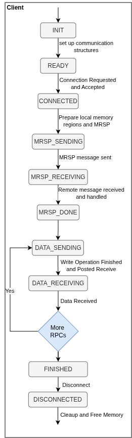

NAAICE Low-Level API Documentation
==================================

This API documents structures and methods for client implementations. Server methods are documented on the Software-NAA page. The client (a host machine) requests RPCs on a remote machine, which can be either a host running our software or any API-compatible device such as an FPGA. Host client and server software implement a state machine model. In the error-free case, the client progresses through the states shown in the following figure:

Defines
--------------
..  doxygengroup:: DefinesLowLevel
    :project: naa-communication-prototype
    :content-only:

Structs & Enums
---------------
..  doxygengroup:: StructsEnumsLowLevel
    :project: naa-communication-prototype
    :members:
    :content-only:

Functions
---------
..  doxygengroup:: PublicFunctionsLowLevel
    :project: naa-communication-prototype
    :content-only:

Example
-------

An example of the low-level API can be found in `examples/naaice_client.c <https://git.gfz.de/naaice/naa-communication-prototype/-/blob/main/src/naaice_client.c?ref_type=heads>`_.