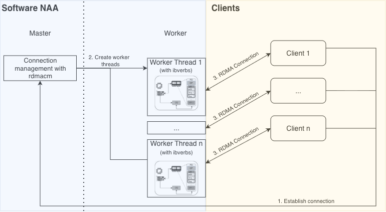

Software-NAA API Documentation
==============================

This page documents the methods of a software-based NAA, which implements the server-side counterpart to clients invoking RPCs via the low-level or middleware API. In the NAAICE project, NAAs were realized using FPGAs, resulting in long development cycles. To facilitate testing and rapid prototyping, a software implementation was developed that replicates the FPGA-based NAA behavior.

The server now also supports multiple connections, which have been implemented using a master-worker concept. The master thread expects connections via a shared event channel and, once the connection has been successfully established, passes them on to the corresponding worker threads (see Figure :numref:`fig-multi-kernel-swnaa`). Currently, the maximum number of parallel connections is set to the number of available cores.

As on the client side, the software NAA transitions through various states that differ slightly from the client. In error-free operation, the following states are traversed:

..  figure:: ../_static/states_server.png

Structs & Enums
---------------
The structs used are identical to those of the low-level API.

Functions
---------
..  doxygengroup:: PublicFunctionsSWNAA
    :project: naa-communication-prototype
    :content-only:

MRSP Packet Handlers
^^^^^^^^^^^^^^^^^^^^
..  doxygengroup:: SWNAAMRSPHandlers
    :project: naa-communication-prototype

Event Handlers
^^^^^^^^^^^^^^
..  doxygengroup:: SWNAAEventHandlers
    :project: naa-communication-prototype

Example
-------

An example implementation of a software NAA can be found in `examples/naaice_server.c <https://github.com/naaice-greenhpc/naa-communication-library/blob/main/examples/naaice_server.c`_.