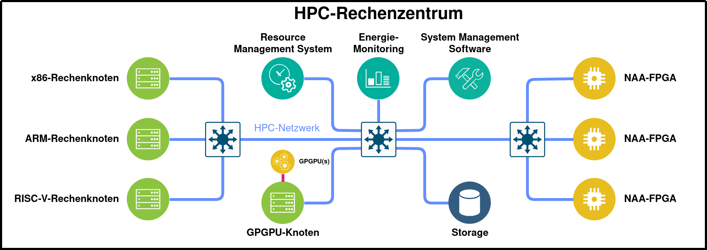
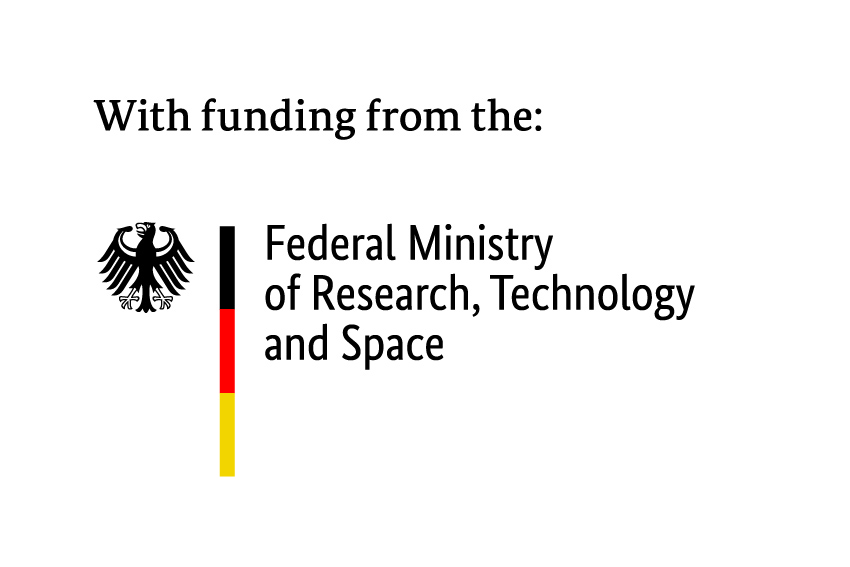

.. naa-communication-library documentation master file, created by
   sphinx-quickstart on Wed Dec 17 11:26:47 2025.
   You can adapt this file completely to your liking, but it should at least
   contain the root `toctree` directive.

Welcome to naa-communication-library's documentation!
=====================================================

This page describes the NAAICE Low-Level and Middleware APIs developed within the NAAICE project. The APIs are designed to simplify the offloading of workloads to Network Attached Accelerators (NAAs) via RoCEv2 in HPC environments. In addition, the internal architecture of a software-based NAA is documented for testing and rapid prototyping.

.. toctree::
   :maxdepth: 1
   :caption: Contents:

   api/introduction.rst
   api/installation.rst
   api/low_level.rst
   api/middleware.rst
   api/swnaa.rst

Indices and tables
==================

* :ref:`genindex`
* :ref:`search`

Funding
=======
The development of the NAAICE Communication Libraries is funded by the BMFTR Germany in the context of the NAAICE_ Project (GreenHPC_ grant)

.. _NAAICE: https://www.greenhpc.eu
.. _GreenHPC: https://gauss-allianz.de/en/project/call/Richtlinie%20zur%20F%C3%B6rderung%20von%20Verbundprojekten%20auf%20dem%20Gebiet%20des%20energieeffizienten%20High-%E2%80%8BPerformance%20Computings%20%28GreenHPC%29
